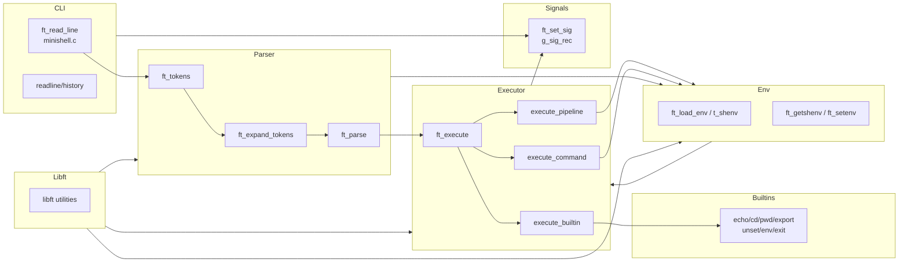

# Minishell – Arquitectura

## 1. Análisis arquitectónico

- `minishell.c:195-238` implementa el ciclo principal `ft_read_line`: configura señales (`ft_set_sig`), carga el entorno con `ft_load_env`, obtiene líneas con `readline`, almacena histórico y, tras cada iteración, reutiliza la lista `t_cli`.
- La fase de **lexing/expansión** (`parsing/lexing.c:120`, `parsing/expansion.c:85`) tokeniza la línea, expande variables/estado de salida y resuelve wildcards (`parsing/wildcards.c:27`), manteniendo compatibilidad con heredocs y comillas.
- El **parser** (`parsing/parsing.c:101`, `parsing/parsing1.c:77`) transforma los tokens en una lista enlazada de `t_cli`, configurando redirecciones, heredocs y operadores lógicos/pipes (`ft_parse_op`).
- El **ejecutor** (`exec/exec.c:15`, `exec/exec_pipe.c:173`) decide entre builtins (`exec/builtins.c:15`), pipelines/heredocs y procesos externos (`execute_command`) usando `fork/execve`, controlando señales (`parsing/signals.c:1`) y estado de salida.
- La **gestión del entorno** (`parsing/shenv.c:1`, `exec/ft_cd.c:63`, `exec/ft_export.c:58`, `exec/ft_unset.c:1`) mantiene un `t_shenv` enlazado y sincroniza variables especiales (`PWD`, `OLDPWD`, etc.).
- Utilidades y memoria recaen en `libft/` (funciones `ft_*` de cadenas, listas y arrays), que actúa como capa de servicios compartidos.

## 2. Tecnologías utilizadas

- Lenguaje C con estándar POSIX (`fork`, `execve`, `pipe`, `dup2`, `waitpid`, `ioctl`, señales).
- GNU Readline (`-lreadline`) para prompt interactivo y gestión del histórico.
- Biblioteca propia `libft` como soporte de utilidades generales.
- `Makefile` que enlaza `libft` y `readline` y compila los módulos del proyecto.

## 3. Estructura de carpetas y archivos

```text
.
├── minishell.c            # Bucle principal, configuración de señales y entrada
├── minishell.h            # Definiciones de structs, macros y prototipos
├── exec/                  # Motor de ejecución (builtins, pipelines, procesos)
│   ├── builtins.c
│   ├── exec.c
│   ├── exec_pipe.c
│   ├── ft_cd.c
│   ├── ft_export.c
│   └── ft_unset.c
├── parsing/               # Lexing, parsing, expansiones, env interno, señales
│   ├── lexing.c
│   ├── lexing1.c
│   ├── parsing.c
│   ├── parsing1.c
│   ├── expansion.c
│   ├── heredoc.c
│   ├── wildcards.c
│   ├── wc_utils.c
│   ├── shenv.c
│   └── signals.c
├── libft/                 # Biblioteca auxiliar con funciones reutilizables
│   ├── libft.h
│   └── ft_*.c
├── Makefile               # Objetivo `minishell`, vínculo con `libft` y readline
├── main.c                 # Programa de pruebas puntual (no integrado en build)
├── log*.txt               # Ficheros de registro/notas
└── README.md              # Informe arquitectónico del proyecto
```

## 4. Diagrama de arquitectura


